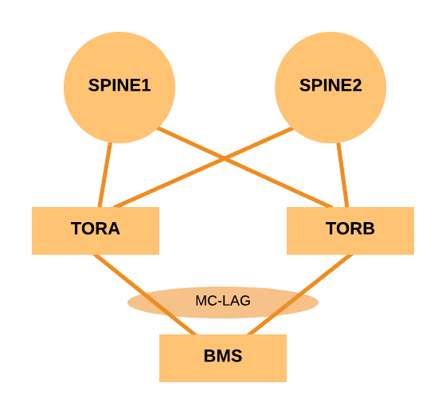
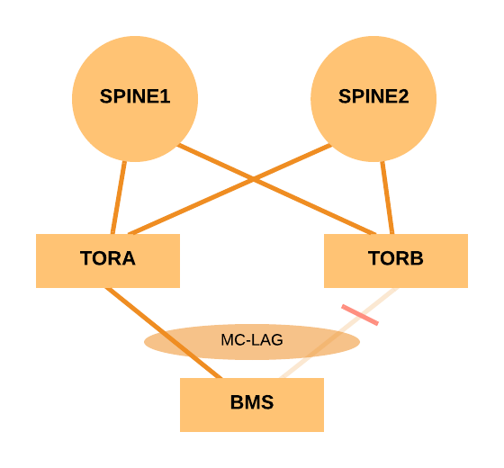

@snap[west span-80]
@size[2.0em](Event-driven automation and orchestration)  
@css[hl](@GRNET)  
@css[hl](with Stackstorm)  
@snapend
@snap[south-west text-05 span-70]
Lefteris Poulakakis  
lepou@noc.grnet.gr
@snapend
---
#### @css[hl](what we have)
@ul[squares]
 - ~50 carrier routers
 - ~150 access switches
 - ~60 datacenter switches
@ulend
---
#### @css[hl](what we have)
@ul[squares]
 - Ansible for config management
 - Git for VCS
 - Tools managing network infrastructure and services
@ulend
---
#### @css[hl](and common workflows...)
@ul[squares]
 - deployment of new services
 - provisioning of new devices/replacement of faulty ones
 - software upgrades
@ulend 
---
#### @css[hl](...that)
@ul[squares]
 - are well defined
 - consume time and human effort
 - although, can be scripted (eg. in runbooks)
@ulend
---
@snap[west text-08 span-100]
### @css[hl](some of our use cases)
@ul
- Datacenter switches mass upgrade
- Zero Touch Provisioning
- Auto-deployment of our Ansible repo changes
- Network Ops tasks part of BMS autoprovision
@ulend
@snapend
---
#### @css[highlight fragment](So...)  
@css[highlight fragment](...let's automate)  
---
#### @css[hl](we need a tool that)
@ul[squares]
 - @css[highlight](senses) changes at the tools or the network
 - @css[highlight](trigger) @css[highlight](actions) based on them
 - can abstract @css[highlight](actions) into complex @css[highlight](workflows)
 - interact with the network and our tools
@ulend
---
@snap[norht-west span-60]
### @css[hl](Stackstorm)
@snapend
@ul[squares]
- solid base featureset
- Lots of intergration with other tools  (ST2 calls them @css[highlight](packs))
- Support for "standard" wordflow language (Openstack's @css[highlight](Mistral))
- Native intergration with network infrastructure (with @css[highlight](NAPALM) pack)
@ulend
---
@snap[west span-60]
### @css[hl](Stackstorm)
@fa[quote-left fa-xs](IF-This-Then-That automation)
@snapend

@snap[north-east text-left text-07 fragment span-50]
@css[hl](Sensors)  
Inbound/Outbound intergration. Receive/poll for events.
@snapend

@snap[east text-07 text-left fragment span-50]
@css[hl](Triggers)  
Result of an activated sensor.
@snapend

@snap[south-east text-07 text-left fragment span-50]
@css[hl](Actions)  
Outbound intergrations. A REST API call, an ansible playbook or a custom script.
@snapend
---
@snap[west span-60]
### @css[hl](Stackstorm)
@fa[quote-left fa-xs](IF-This-Then-That automation)
@snapend

@snap[north-east text-07 text-left span-50]
@css[hl](Rules)  
Map triggers to actions. Filter against criteria and pass trigger data to the actions run
@snapend

@snap[east text-07 text-left fragment span-50]
@css[hl](Workflows)  
A connected set of actions. 
@snapend

@snap[south-east text-07 text-left fragment span-50]
@css[hl](Packs)  
Units of content deployment.  
Eq. to a module or a plugin.
@snapend
---
@snap[north text-09 span-60]
#### @css[hl](Architecture)
@snapend
@snap[midpoint span-100]

@snapend

---?code=code/pack-tree.txt
@snap[north-west  span-100]
#### @css[hl](The anatomy of a pack)  
@snapend

---?code=code/pack-tree-2.txt
@snap[north-west  span-100]
#### @css[hl](The anatomy of a pack)  
@snapend

---
@snap[north text-10 span-80]
@css[hl](DC switches mass upgrade)  
@css[highlight](Our DCs architecture)
@snapend
@snap[south span-50]

@snapend
---
@snap[north text-10 span-80]
@css[hl](DC switches mass upgrade)  
@css[highlight](Our DCs architecture)
@snapend
@snap[south span-50]

@snapend

---?image=assets/img/upgrade-leaf-workflow.png&size=70%

---?image=assets/img/upgrade-leaf-workflow-01.png&size=70%

---?code=code/upgrade-leaf-rule.yaml
@snap[north-west text-08 span-100]
@css[highlight](rules/upgrade-leaf.yaml)
@snapend

---?image=assets/img/upgrade-leaf-workflow-02.png&size=70%

---?code=code/drain-leaf-01.yaml
@snap[north-west text-08 span-100]
@css[highlight](actions/workflows/upgrade-leaf.yaml)
@snapend

---?image=assets/img/upgrade-leaf-workflow-03.png&size=70%

---?code=code/drain-leaf-04.yaml
@snap[north-west text-08 span-100]
@css[highlight](actions/workflows/drain-leaf.yaml)
@snapend

---?image=assets/img/upgrade-leaf-workflow-04.png&size=70%

---?code=code/junos-upgrade-02.yaml
@snap[north-west text-08 span-100]
@css[highlight](actions/workflows/junos-upgrade.yaml)
@snapend

---?image=assets/img/upgrade-leaf-workflow-05.png&size=70%

---?code=code/drain-leaf-02.yaml
@snap[north-west text-08 span-100]
@css[highlight](actions/workflows/undrain-leaf.yaml)
@snapend

---?code=code/undrain-leaf-01.yaml
@snap[north-west text-08 span-100]
@css[highlight](actions/workflows/undrain-leaf.yaml)
@snapend

---?image=assets/img/upgrade-leaf-workflow-06.png&size=70%

---?code=code/undrain-leaf-02.yaml
@snap[north-west text-08 span-100]
@css[highlight](actions/workflows/undrain-leaf.yaml)
@snapend
---
@snap[west text-08 span-100]
### @css[hl](some of our use cases)
@ul
- Datacenter switches mass upgrade (done for leaf switches)
- Zero Touch Provisioning (done)
- Network Ops tasks part of BMS autoprovision (developing)
- Auto-deployment of our Ansible repo changes (brainstorming)
@ulend
@snapend
---
@snap[west text-08 span-100]
### @css[highlight](to sum up)
@ul
- runbooks all the way
- automate common tasks
- trust automation for more critical tasks
- can't automate the human
@ulend
---
@snap[midpoint text-09 span-100]
@css[hl](Questions?)
